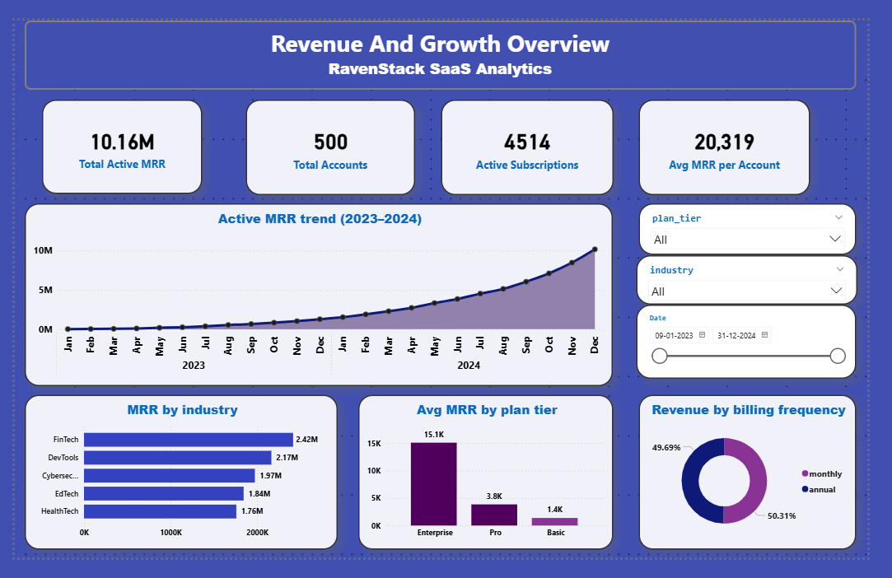
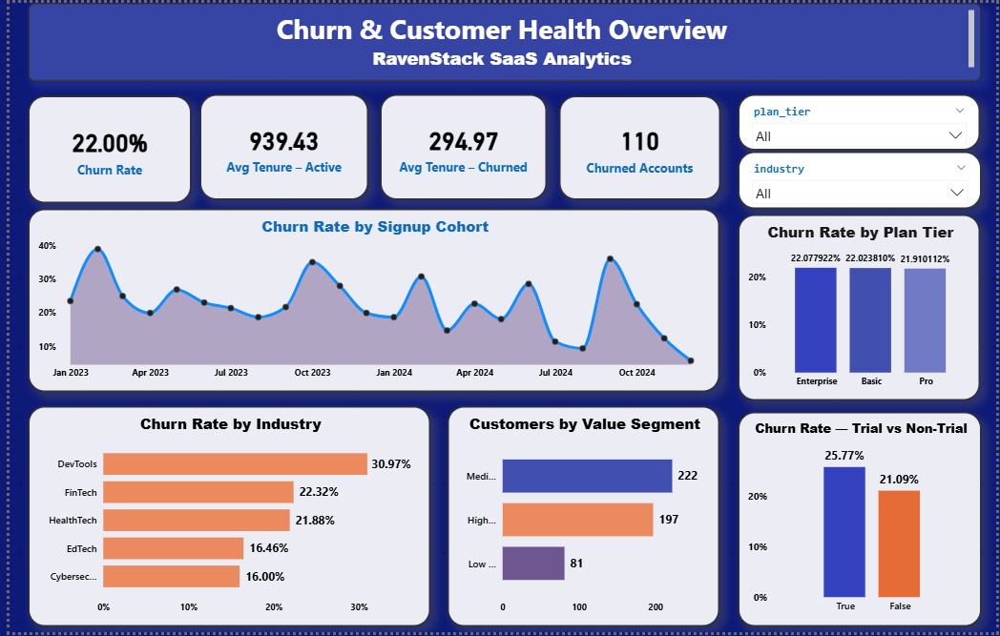

<h1>RavenStack SaaS Business Analytics</h1>

<strong>SQL Business Analysis + Power BI Dashboard</strong>

  A portfolio case study analysing customer, subscription, revenue, acquisition, segmentation and churn patterns for a fictional SaaS business.

  
  
  
  

<h2>📌 Project Overview</h2>

RavenStack is a fictional AI-powered collaboration SaaS platform created as a realistic business simulation for practising data analysis and business intelligence. The dataset represents customer accounts and subscription lifecycles over approximately two years.

The project was built as a complete analytics workflow: first validating and analysing the relational data with SQL, then converting the resulting business questions and KPIs into an interactive Power BI dashboard.

<h2>🎯 Why This Project?</h2>

This project was designed to demonstrate how a junior Data Analyst can move from raw relational data to business decisions rather than only producing isolated SQL queries or charts.

<ul>
  <li>Validate data quality before trusting business metrics.</li>
  <li>Use SQL to answer realistic SaaS business questions.</li>
  <li>Translate SQL findings into measurable business KPIs.</li>
  <li>Build a clean Power BI dashboard around two clear business stories: growth/revenue and churn/customer health.</li>
  <li>Document assumptions and data limitations instead of hiding them.</li>
</ul>

<h2>🗂️ Dataset</h2>

<strong>RavenStack Synthetic SaaS Dataset</strong> — created by <strong>River @ Rivalytics</strong>.

The dataset is fully synthetic and contains no real customer PII. This project uses two related tables only, keeping the scope realistic and focused:

<table>
  <thead>
    <tr>
      <th>Table</th>
      <th>Rows</th>
      <th>Purpose</th>
    </tr>
  </thead>
  <tbody>
    <tr>
      <td><code>accounts</code></td>
      <td>500</td>
      <td>Customer/account metadata such as industry, country, signup date, referral source, plan and seats.</td>
    </tr>
    <tr>
      <td><code>subscriptions</code></td>
      <td>5,000</td>
      <td>Subscription lifecycle, plan, seats, MRR, ARR, billing frequency, upgrades, downgrades and status.</td>
    </tr>
  </tbody>
</table>

<h3>Relationship</h3>

The two tables are connected through <code>account_id</code>:

<pre><code>accounts[account_id]  1 ───────── *  subscriptions[account_id]</code></pre>

This one-to-many relationship allows account-level attributes to be analysed alongside subscription-level revenue and lifecycle information.

<h2>🧭 Project Workflow</h2>

<ol>
  <li><strong>Database setup</strong> — imported the two CSV datasets into MySQL.</li>
  <li><strong>Database familiarisation</strong> — verified database, tables, schemas, record counts and sample records.</li>
  <li><strong>Data validation</strong> — checked duplicates, referential integrity and NULL completeness.</li>
  <li><strong>Business SQL analysis</strong> — answered 30 business questions from beginner through advanced level.</li>
  <li><strong>KPI definition</strong> — identified the core metrics required for management reporting.</li>
  <li><strong>Power BI modelling</strong> — loaded the same two tables and created the account-to-subscription relationship.</li>
  <li><strong>Dashboard development</strong> — built two focused dashboard pages for growth/revenue and churn/customer health.</li>
</ol>

<h2>🧠 SQL Analysis</h2>

The SQL phase contains <strong>30 business-focused questions</strong> progressing from data quality checks to advanced analytical patterns.

<table>
  <thead>
    <tr>
      <th>Level</th>
      <th>Questions</th>
      <th>Focus</th>
    </tr>
  </thead>
  <tbody>
    <tr>
      <td>Beginner</td>
      <td>Q1–Q10</td>
      <td>Data validation, customer mix, referral sources, plan distribution and subscription counts.</td>
    </tr>
    <tr>
      <td>Intermediate</td>
      <td>Q11–Q20</td>
      <td>Active MRR/ARR, subscription status, growth, trial analysis, billing, industry and acquisition analysis.</td>
    </tr>
    <tr>
      <td>Advanced</td>
      <td>Q21–Q30</td>
      <td>Window functions, ranking, CTEs, cohort analysis, customer segmentation, tenure and executive KPI reporting.</td>
    </tr>
  </tbody>
</table>

<h3>SQL techniques demonstrated</h3>

<code>SELECT</code>, <code>WHERE</code>, <code>GROUP BY</code>, <code>HAVING</code>, <code>ORDER BY</code>, aggregate functions, conditional aggregation, <code>CASE WHEN</code>, <code>INNER JOIN</code>, <code>LEFT JOIN</code>, CTEs, subqueries, <code>CROSS JOIN</code>, <code>RANK()</code>, <code>DENSE_RANK()</code>, <code>ROW_NUMBER()</code>, <code>LAG()</code>, windowed <code>SUM()</code>, date functions and percentage calculations.

<h2>📊 Key Business Questions</h2>

<ul>
  <li>How much active MRR and ARR does the business currently generate?</li>
  <li>How many subscriptions are active versus ended?</li>
  <li>Which industries generate the most active MRR?</li>
  <li>Which plan tiers generate the highest average MRR?</li>
  <li>Which acquisition channels bring the highest-value customers?</li>
  <li>How quickly are subscription starts growing month over month?</li>
  <li>How does churn differ across plans, industries and signup cohorts?</li>
  <li>How are customers distributed across value segments?</li>
  <li>Which accounts contribute the most subscription revenue?</li>
  <li>What does the executive KPI snapshot look like in one query?</li>
</ul>

<h2>📈 Key Findings</h2>

<ul>
  <li><strong>500 accounts</strong> and <strong>5,000 subscription records</strong> were analysed.</li>
  <li>The overall account churn rate is <strong>22%</strong> (110 churned accounts out of 500).</li>
  <li>Active subscriptions total <strong>4,514</strong>, with approximately <strong>$10.16M active MRR</strong>.</li>
  <li>Active customer tenure averages approximately <strong>919 days</strong>, compared with approximately <strong>295 days</strong> for churned customers.</li>
  <li><strong>DevTools</strong> has the highest customer count at <strong>113 accounts</strong>, while <strong>FinTech</strong> generates the highest active MRR at approximately <strong>$2.42M</strong>.</li>
  <li><strong>Enterprise</strong> has the highest average subscription MRR among the three plan tiers analysed.</li>
  <li><strong>Organic</strong> is the largest acquisition source by account count and shows the highest average MRR per subscription record among the referral sources analysed.</li>
  <li>The customer-value segmentation contains <strong>165 High Value</strong>, <strong>244 Medium Value</strong>, and <strong>91 Low Value</strong> accounts based on the project-defined MRR thresholds.</li>
  <li>The strongest individual revenue accounts are concentrated among a small set of customers, showing meaningful customer-value concentration.</li>
</ul>

<h2>⚠️ Analytical Notes & Limitations</h2>

This project deliberately documents limitations and business definitions where the source data does not provide a perfect measure.

<ul>
  <li>The dataset's Boolean and date fields were imported as text in MySQL; the analysis accounts for that representation where required.</li>
  <li>The available tables do not provide an explicit customer-level trial-conversion flag, so the trial analysis should not be presented as a definitive paid-conversion metric.</li>
  <li>The churn analysis distinguishes account-level churn from subscription-level status.</li>
  <li>The cohort churn analysis should be interpreted carefully for recent cohorts because newer cohorts have had less time to experience churn.</li>
  <li>The project uses the latest subscription <code>end_date</code> as a proxy for customer lifecycle end when analysing tenure because an explicit customer-level churn date is not available in the two selected tables.</li>
  <li>The value-segmentation thresholds are analyst-defined for this case study and are intended for portfolio demonstration, not as official SaaS policy.</li>
</ul>

<h2>📊 Power BI Dashboard</h2>

The Power BI report contains two focused pages so that the dashboard remains readable and business-oriented.

<h3>1. Revenue &amp; Growth Overview</h3>

<strong>Business story:</strong> How is the SaaS business performing in terms of recurring revenue, customer scale and subscription growth?

<ul>
  <li>Total Active MRR</li>
  <li>Total Accounts</li>
  <li>Active Subscriptions</li>
  <li>Average MRR per Account</li>
  <li>Active MRR trend</li>
  <li>Active MRR by industry</li>
  <li>Average MRR by plan tier</li>
  <li>Revenue mix by billing frequency</li>
</ul>

  

<h3>2. Churn &amp; Customer Health Overview</h3>

<strong>Business story:</strong> Where are the major customer-retention risks and how does customer health differ across segments?

<ul>
  <li>Churn Rate</li>
  <li>Average Tenure — Active</li>
  <li>Average Tenure — Churned</li>
  <li>Churned Accounts</li>
  <li>Churn rate by plan tier</li>
  <li>Churn rate by industry</li>
  <li>Churn rate by signup cohort</li>
  <li>Customers by value segment</li>
  <li>Trial vs non-trial churn comparison</li>
</ul>

  

<h2>🛠️ Tools &amp; Technologies</h2>

<table>
  <thead>
    <tr>
      <th>Tool</th>
      <th>Usage</th>
    </tr>
  </thead>
  <tbody>
    <tr><td><strong>MySQL</strong></td><td>Database storage, data validation and SQL business analysis.</td></tr>
    <tr><td><strong>Jupyter Notebook</strong></td><td>Documented the SQL questions, queries, outputs and business observations in one reproducible workflow.</td></tr>
    <tr><td><strong>Python / Pandas</strong></td><td>Executed SQL from the notebook and displayed query outputs for analysis.</td></tr>
    <tr><td><strong>SQLAlchemy</strong></td><td>Database connection between the notebook and MySQL.</td></tr>
    <tr><td><strong>Power BI</strong></td><td>Data modelling, DAX measures, KPI reporting, interactive filtering and dashboard visualisation.</td></tr>
    <tr><td><strong>GitHub</strong></td><td>Version control and portfolio presentation.</td></tr>
  </tbody>
</table>

<h2>📁 Repository Structure</h2>

<pre><code>ravenstack-saas-business-analytics/
│
├── data_sets/
│   ├── accounts.csv
│   └── subscriptions.csv
│
├── RavenStack_SQL_Analysis.ipynb
├── RavenStack_SaaS_Dashboard.pbix
├── sql_question_one_1.sql
├── RavenStack SQL — questions.txt
├── screenshots/
│   ├── revenue-growth-overview.png
│   └── churn-customer-health.png
└── README.md
</code></pre>

<em>Note: repository filenames can be adjusted to match the final uploaded files.</em>

<h2>✅ What I Achieved</h2>

By completing this case study, I demonstrated an end-to-end Data Analyst workflow:

<ol>
  <li>Worked with a relational SaaS dataset rather than a single flat file.</li>
  <li>Validated data quality and referential integrity before relying on business metrics.</li>
  <li>Translated realistic business questions into SQL analysis.</li>
  <li>Applied intermediate and advanced SQL techniques, including CTEs and window functions.</li>
  <li>Defined and interpreted SaaS KPIs such as active MRR, churn rate, subscription counts and average customer value.</li>
  <li>Converted analytical findings into a clean two-page Power BI report.</li>
  <li>Documented business assumptions and limitations where the available data did not support a perfect metric.</li>
</ol>

<h2>👤 Author</h2>

<strong>Janardhan</strong> 
Aspiring Data Analyst / Data Scientist 
SQL • Python • Power BI • Machine Learning

<h2>📚 Dataset Credit</h2>

This project uses the <strong>RavenStack Synthetic SaaS Dataset</strong> by <strong>River @ Rivalytics</strong>. The dataset is synthetic and intended for learning, research and portfolio use. Credit is retained as required by the original dataset documentation.

  
<strong>RavenStack SaaS Business Analytics</strong>

  
From relational data → SQL analysis → business KPIs → Power BI insights.

